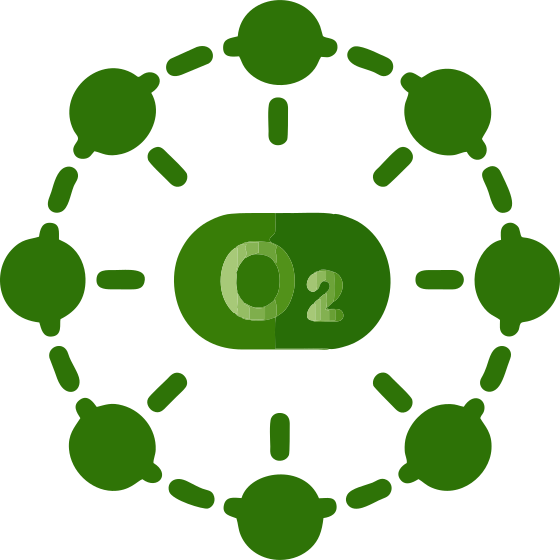
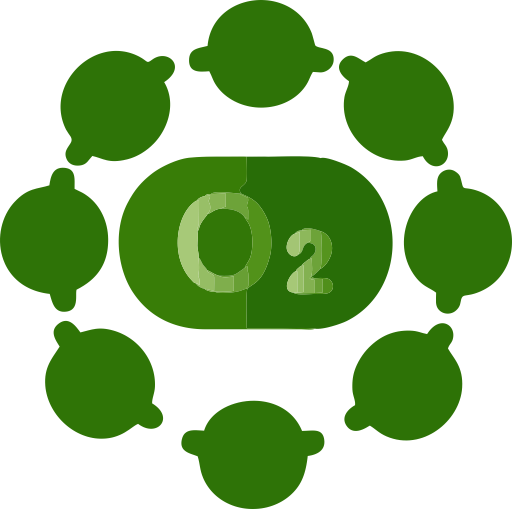

**slag:** aqdapp

**title:** Air Quality Data App

**full title:** Система збору та обробки даних мережі моніторингу якості повітря

**short descriptor:** Це бакалаврський дипломний проєкт Владислава Прощаваєва, нині (станом на лютий 2021) студента 4-го курсу Національного авіаційного університету, Київ, Україна. Проєкт спрямований на вирішення проблеми дефіциту об'єктивної і вчасної інформації щодо якості повітря в столиці України, на тлі відсутності системи оперативного інформування громадян щодо шкідливих станів повітря та постійно зростаючого занепокоєння громади, викликаним регулярними інцидентами на кшталт задимленості восени 2019 року або [пожеж у Чорнобильській зоні вітчуження навесні 2020 року](https://protw.github.io/airzoom/#Пожежі у зоні відчуження і уроки Чорнобиля). Для вирішення зазначених проєкт ставить своїм завданням розробку системи збору, обробки та представлення даних мережі моніторингу якості повітря.

**logo:** 
**favicon:** 

